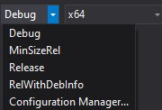
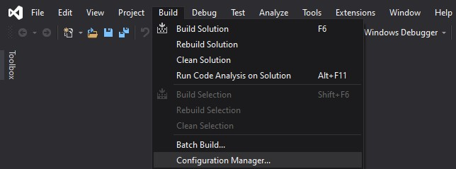

These docs are made to be easily understood by someone with decent computer knowledge, one thing I hate as a highschool student is something with confusing documentation.

Disclaimer: Currently I'm not worrying about backwards-compatability, these docs may contain misinformation.

# Adding R6pp to your project

### Thirdparty 

R6pp is built using [RapidJSON](https://github.com/Tencent/rapidjson) and [CPR](https://github.com/whoshuu/cpr)
When developing the project I tried to make installation of the dependencies as easy as possible, of course some platforms are not accounted for (Apple for example) so if you encounter any problems just create a [Pull Request](https://github.com/AmFobes/R6pp/compare) if you have a solution or an [Issue](https://github.com/AmFobes/R6pp/issues/new).

If you need any specific build flags / definitions the only ones R6pp modify are 

| Flag / Definition                   | Value | Platform | Comment                                 |
|:------------------------------|:------|:---------|:----------------------------------------|
| _SILENCE_TR1_NAMESPACE\_ DEPRECATION_WARNING|   | ALL      | See CMakeLists.txt or gtest [Issue](https://github.com/google/googletest/issues/1111)                     
| CMAKE_USE_WINSSL                          | `ON`  | Windows  | Use WINSSL for Windows|                                           
| CMAKE_USE_OPENSSL                         | `ON` | Linux  | Use OPENSSL for Linux       |
| CMAKE_USE_DARWINSSL             | `ON` | Mac | Use DARWINSSL for mac/osx |
| USE_SYSTEM_CURL                           | `ON`  | Linux    | Running apt is easier than building     |
| BUILD_CURL_EXE                            | `OFF` | ALL      | CURL executable isn't used              |
| CURL_STATICLIB                            | `ON`  | ALL      | Statically link cpr to CURL             | 
| BUILD_CPR_TESTS                           | `OFF` | ALL      | Issues when running tests on windows    |
| RAPIDJSON_BUILD_EXAMPLES                  | `OFF` | ALL      | Possible issues when building examples? |
| RAPIDJSON_BUILD_TESTS                     | `OFF` | ALL      | Issues when running tests on windows    |

## CMake Submodule 

### (Recommended)

Possibly the easiest way to implement the project

Create a dependency folder and enter the directory
```bash
$ mkdir deps
$ cd deps
```
Git clone **(Make sure you add the --recursive, you need the thirdparty submodules)**
```bash
$ git clone https://github.com/AmFobes/R6pp.git --recursive
```
Go back to your main project directory and edit your CMakeLists.txt so it looks something like this
```cmake
cmake_minimum_required (VERSION 3.4)

project(MyProject)

add_subdirectory(deps/R6pp/R6pp) # Add the R6pp Directory so cmake notices the project
include_directories(deps/R6pp/R6pp/include) # Add the R6pp header directory so R6pp.h is found

add_executable(MyExecutable "main.cpp")
target_link_libraries(MyExecutable R6pp) # Link the R6pp library to your executable / library
```

Once that's done run cmake
```bash
$ cmake .
# OR
$ cmake CMakeLists.txt
```
then build the project
```bash
$ make
# Or to make the build faster
$ make -j 4 #(4 being number of threads)
```

## Build it as a library

Works but not really recommended

Clone the project **(Make sure you add the --recursive, you need the thirdparty submodules)**
```bash
$ git clone https://github.com/AmFobes/R6pp.git --recursive
```
`cd` into the subdirectory and Run cmake
```
$ cd R6pp/R6pp
$ cmake .
# or 
$ cmake CMakeLists.txt
```
Proceed to one of the steps below

### Windows with Visual Studio
Once you ran cmake, a .sln (R6pp.sln) file should've been created, open the solution in visual studio.
Select either **Debug** or **Release** (Default is Debug)



Look at the top, left justified menu with \|File\|Edit\|View\| etc
Under \|Build\| click **Build Solution**



After waiting a little bit the library file you need will be located at
    `R6pp/R6pp/Debug/R6pp-d.lib`
or
    `R6pp/R6pp/Release/R6pp.lib`